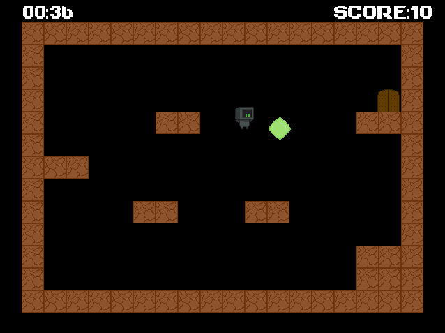
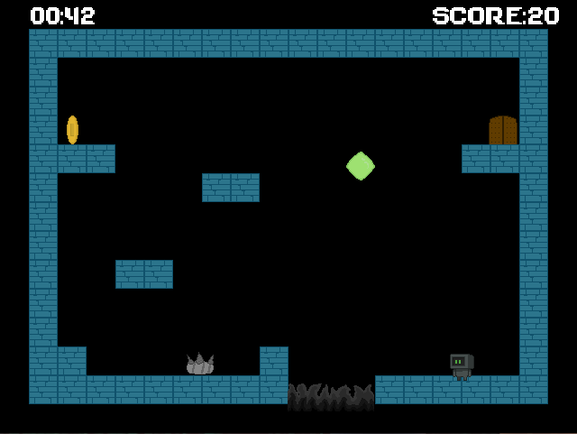
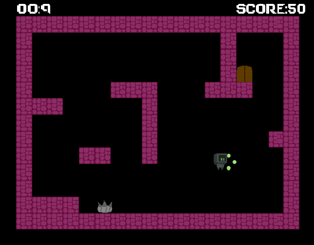

# Adventures of Robo

A 2D game engine made in SDL2 as a part of a university assignment.

## Features
Tilemap collision.  
Enemies reset the player's position.  
The player buff allows a double jump.  
Controls -  
A - Left  
D - Right  
Spacebar - Jump
  

## Package Versions [nuget] .NET

